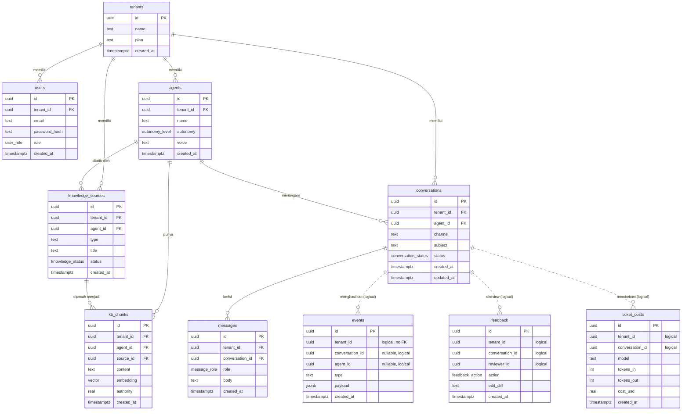

# Genesis AI — Database Design

> **Versi:** 1.0 · **Owner:** CTO · **Tanggal:** 2026-06-26
> **Sumber kebenaran skema:** [`src/db/schema.ts`](../src/db/schema.ts) (Drizzle). Dokumen ini menjelaskan *kenapa*-nya.
> **Terkait:** [ARCHITECTURE.md](ARCHITECTURE.md) · [ADR-0001 PostgreSQL](adr/0001-postgresql.md) · [ADR-0002 Vector Store](adr/0002-vector-store.md)

---

## 1. ERD (Entity Relationship Diagram)

> **Garis padat (`||--o{`)** = relasi dengan **FK constraint + cascade**.
> **Garis putus (`||..o{`)** = relasi **logis** (kolom uuid tanpa FK) — sengaja, lihat §5.

---

## 2. Database Design — keputusan & konvensi

**Engine:** PostgreSQL + pgvector ([ADR-0001](adr/0001-postgresql.md), [ADR-0002](adr/0002-vector-store.md)).

**Konvensi:**
- **Primary key:** `uuid` (`defaultRandom`) di semua tabel. Alasan: aman dipakai lintas service/eksternal, tak membocorkan jumlah baris, ramah distribusi/sharding kelak (vs serial integer).
- **Timestamp:** `timestamptz` (`with timezone`), `created_at` default `now()`. `conversations` juga punya `updated_at`.
- **`tenant_id` di SETIAP tabel** — fondasi multi-tenancy (lihat §6).
- **Enum di level DB** (bukan string bebas): `user_role`, `autonomy_level`, `conversation_status`, `message_role`, `feedback_action`, `knowledge_status`. Alasan: integritas data dijaga DB, bukan hanya aplikasi.
- **Default aman di data:** `agents.autonomy` default `draft_for_approval` (trust ladder mulai konservatif — Human Approval).
- **Naming:** `snake_case` tabel & kolom; tabel jamak (`agents`, `conversations`).
- **Migrasi:** hanya lewat Drizzle versioned ([ENGINEERING-BIBLE.md §6](ENGINEERING-BIBLE.md)). Tidak ada perubahan skema manual.

**Tiga kelas tabel (penting untuk memahami desain):**
1. **Entitas inti** (`tenants`, `users`, `agents`, `knowledge_sources`, `kb_chunks`, `conversations`, `messages`) — relasional penuh, FK + cascade.
2. **Log / system of record** (`events`) — **APPEND-ONLY**, tanpa FK, payload `jsonb` fleksibel.
3. **Turunan / sidecar** (`feedback`, `ticket_costs`) — catatan analitik/pembelajaran, tanpa FK.

---

## 3. Normalization

Desain inti pada dasarnya **Third Normal Form (3NF)** — minim redundansi, tiap fakta hidup di satu tempat:

- Identitas tenant hanya di `tenants`; tabel lain mereferensikan via `tenant_id`.
- Pengetahuan dipisah `knowledge_sources` (metadata sumber) ↔ `kb_chunks` (potongan + embedding) — relasi 1-ke-banyak, bukan menumpuk konten di satu kolom.
- Pesan dipisah dari percakapan (`messages` ↔ `conversations`).

**Denormalisasi yang disengaja (dengan alasan):**
- **`tenant_id` direplikasi ke setiap tabel** (padahal bisa diturunkan via join). Alasan: (a) keamanan — filter `tenant_id` langsung tanpa join rawan-lupa; (b) performa — index `tenant_id` di tiap tabel; (c) RLS butuh kolom lokal. *Trade-off ini dibeli demi keamanan & kecepatan.*
- **`events.payload` sebagai `jsonb`** — sengaja schemaless. Event punya bentuk beragam (`agent.drafted`, `ticket.received`, dll); memaksanya ke kolom kaku akan rapuh. Fleksibilitas log > normalisasi ketat di sini.
- **`kb_chunks.embedding` (vector)** — vektor disimpan inline bersama konten (bukan tabel terpisah) demi retrieval satu-query.
- **`ticket_costs`** menyimpan agregat token/biaya per panggilan — turunan yang sengaja dimaterialisasi untuk query metrik cepat (hindari menghitung ulang dari event tiap saat).

**Prinsip:** normalisasi sebagai default; denormalisasi hanya saat keamanan atau performa menuntut, dan selalu dicatat.

---

## 4. Indexes

Semua terdefinisi di [`src/db/schema.ts`](../src/db/schema.ts). Setiap index melayani pola query nyata.

| Tabel | Index | Kolom | Tujuan |
|---|---|---|---|
| users | `users_email_idx` | `email` | Lookup login |
| users | `users_tenant_idx` | `tenant_id` | Scope tenant |
| agents | `agents_tenant_idx` | `tenant_id` | List agent per tenant |
| knowledge_sources | `ksrc_tenant_agent_idx` | `tenant_id, agent_id` | Sumber per agent |
| kb_chunks | `kbchunks_tenant_agent_idx` | `tenant_id, agent_id` | Filter retrieval per agent |
| kb_chunks | `kbchunks_embedding_idx` | `embedding` (**HNSW**, `vector_cosine_ops`) | **Similarity search cepat** (RAG) |
| conversations | `conv_tenant_idx` | `tenant_id` | List percakapan |
| conversations | `conv_status_idx` | `tenant_id, status` | Review queue / filter status |
| messages | `msg_conv_idx` | `conversation_id` | Ambil transcript |
| events | `events_tenant_idx` | `tenant_id` | Audit log per tenant |
| events | `events_conv_idx` | `conversation_id` | Replay per percakapan |
| events | `events_type_idx` | `tenant_id, type` | Metrik (hitung per tipe event) |

**Prinsip index:**
- **Composite mengikuti pola filter** (mis. `tenant_id, status` untuk review queue, bukan dua index terpisah).
- **HNSW** dipilih untuk vektor (vs IVFFlat) demi kualitas/latency recall pada beban baca dominan.
- Index ditambahkan **saat pola query diketahui**, bukan spekulatif — hindari over-indexing yang memperlambat write.
- Tabel high-write (`events`, `messages`) dijaga indexnya ramping; pada skala → partisi by time (roadmap).

---

## 5. Relationship (cardinality & cascade)

**Relasi ber-FK (cascade on delete):**

| Parent → Child | Kardinalitas | On delete |
|---|---|---|
| tenants → users | 1 : N | CASCADE |
| tenants → agents | 1 : N | CASCADE |
| tenants → knowledge_sources | 1 : N | CASCADE |
| tenants → conversations | 1 : N | CASCADE |
| agents → knowledge_sources | 1 : N | CASCADE |
| agents → kb_chunks | 1 : N | CASCADE |
| agents → conversations | 1 : N | CASCADE |
| knowledge_sources → kb_chunks | 1 : N | CASCADE |
| conversations → messages | 1 : N | CASCADE |

→ Menghapus tenant membersihkan seluruh data turunannya secara otomatis (relevan untuk penghapusan akun / GDPR pada entitas inti).

**Relasi logis (TANPA FK) — keputusan desain disengaja:**
`events`, `feedback`, `ticket_costs` menyimpan `tenant_id`/`conversation_id` sebagai uuid biasa, **tidak** di-constraint FK. Alasan:
1. **`events` adalah system of record append-only** — ia tidak boleh ikut ter-*cascade-delete* atau dibatasi referensial; log harus bertahan & independen (mendukung audit/replay/training).
2. **Decoupling** — tabel log/sidecar bisa diekstrak ke storage terpisah (atau event bus) kelak tanpa drama FK.
3. **Write cepat** — tanpa pengecekan FK pada jalur panas (tiap aksi agent meng-emit event).

**Konsekuensi yang harus dikelola di aplikasi (jujur):** karena tanpa cascade, penghapusan tenant **tidak** otomatis menghapus baris di `events`/`feedback`/`ticket_costs`. Penghapusan/anonomisasi data log saat hak-untuk-dihapus dijalankan **harus eksplisit di level aplikasi** (lihat §6). Ini trade-off sadar: integritas log vs kemudahan delete.

---

## 6. Data Ownership

**Model kepemilikan: tenant adalah pemilik mutlak datanya.**

- **Unit kepemilikan = `tenant`.** Setiap baris bermuara ke satu tenant lewat `tenant_id`. Tidak ada data lintas-tenant.
- **Isolasi (Security By Default):**
  - `tenant_id` **selalu** diturunkan dari token auth (`req.auth.tenantId`), tak pernah dari input klien ([context.ts](../src/lib/context.ts)).
  - Setiap query data tenant difilter `tenant_id`.
  - **Roadmap: Postgres Row-Level Security (RLS)** sebagai lapis kedua — DB menolak akses lintas-tenant bahkan bila query lupa filter.
- **Klasifikasi data:**
  | Kelas | Tabel | Sensitivitas |
  |---|---|---|
  | Identitas | tenants, users | PII (kredensial di-hash scrypt) |
  | Konfigurasi | agents | rendah |
  | Pengetahuan pelanggan | knowledge_sources, kb_chunks | **aset bernilai + bisa memuat PII** |
  | Percakapan | conversations, messages | **PII pelanggan-akhir** |
  | Log/derived | events, feedback, ticket_costs | bisa memuat cuplikan PII di payload |
- **Knowledge = aset perusahaan** (Knowledge Is Company Asset): milik tenant, ter-kurasi, dan koreksi reviewer memperkayanya.
- **Retensi & hak-untuk-dihapus (GDPR-ready):**
  - Entitas inti: hapus tenant → cascade membersihkan users/agents/knowledge/conversations/messages.
  - Tabel log tanpa-FK: penghapusan/anonimisasi **eksplisit** (job aplikasi) — minimal hapus/redaksi PII di `messages` & `events.payload`. (Item roadmap: prosedur "tenant data erasure".)
  - **PII minimization:** kirim ke model seperlunya; enkripsi at-rest & in-transit.
- **Audit kepemilikan:** setiap akses/aksi administratif tercatat di `events` (Every Action Has Context).

---

## Catatan Skala (forward-looking)

- **High-write tables** (`events`, `messages`): jalur skala = partisi by `created_at` + retensi/archival ke object store.
- **Vector scale:** bila pgvector mentok → migrasi ke vector DB ([ADR-0002](adr/0002-vector-store.md)); retrieval sudah diabstraksi.
- **Read scale:** read replica → caching (Redis) untuk query metrik berat.
- **Tenant raksasa:** opsi isolasi lebih keras (schema-per-tenant / DB-per-tenant) dicadangkan untuk enterprise (Phase 3), bukan sekarang.

*Skema ini adalah fondasi. Perubahan apa pun lewat migrasi Drizzle + (untuk keputusan besar) ADR.*
