# Genesis AI — High-Level Architecture

> **Versi:** 1.0 · **Owner:** CTO · **Tanggal:** 2026-06-26
> **Status:** Pandangan tingkat-tinggi (C4-style). Detail mendalam ada di [ARCHITECTURE.md](ARCHITECTURE.md).
> **Terkait:** [PRD-MASTER.md](PRD-MASTER.md) · [PRODUCT-PRINCIPLES.md](PRODUCT-PRINCIPLES.md) · [ENGINEERING-BIBLE.md](ENGINEERING-BIBLE.md)
> **Catatan:** Diagram memakai Mermaid — ter-render otomatis di GitHub/GitLab/IDE.

---

## 1. System Context

Siapa memakai Genesis dan dengan sistem luar apa ia bicara. (C4 Level 1.)

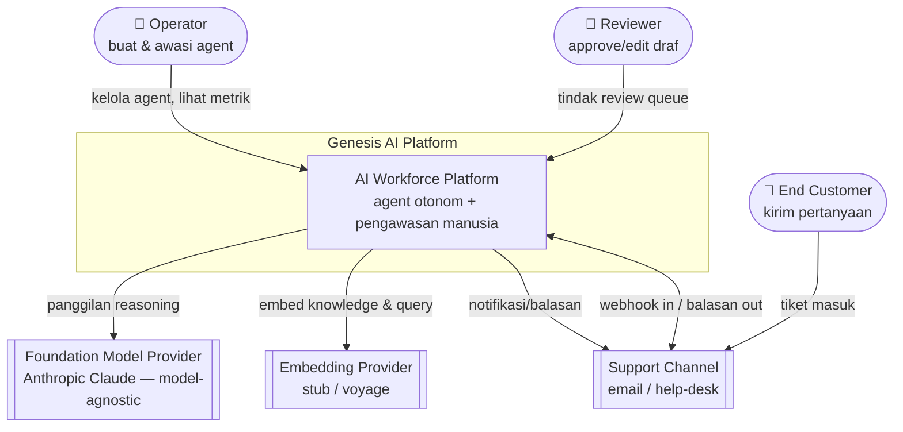

**Inti:** End Customer tidak pernah menyentuh Genesis langsung — ia berinteraksi lewat channel bisnis. Operator & Reviewer adalah pengguna sebenarnya. Model & embedding adalah dependency yang **bisa ditukar** (No Vendor Lock-In).

---

## 2. Microservices (Container View)

Modular monolith dengan batas modul tegas — siap diekstrak. (C4 Level 2.)

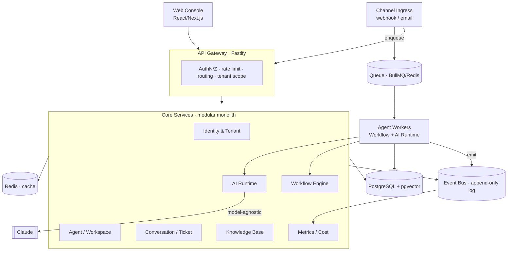

| Service | Tanggung jawab | Fase 1 |
|---|---|---|
| Identity & Tenant | org, user, role, isolasi | modul + managed auth |
| Agent / Workspace | config agent, autonomy | modul |
| Channel Ingress | webhook/email in-out | modul + worker |
| Conversation/Ticket | thread, status, eskalasi | modul |
| Knowledge Base | ingest + retrieval (RAG) | modul + ingest worker |
| Workflow Engine | orkestrasi tiket | worker (state machine) |
| AI Runtime | panggilan model + guardrail | library |
| Metrics/Cost | agregasi event → KPI | consumer |

---

## 3. Data Flow — Siklus Hidup Satu Tiket

Jalur kritis end-to-end, async. (C4 dynamic view.)

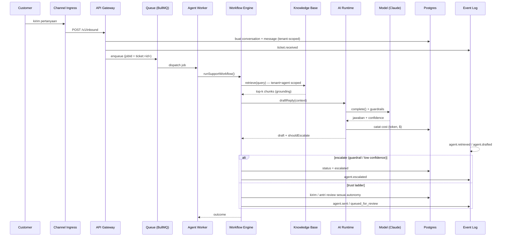

**Prinsip yang terlihat:** async (Queue), grounded (KB sebelum model), deterministic shell (guardrail di AI Runtime), traceable (setiap langkah → Event Log), cost tercatat tiap panggilan.

---

## 4. Workflow Engine & Trust Ladder

Mesin keputusan tiap tiket — dan jenjang otonomi yang ditegakkannya.

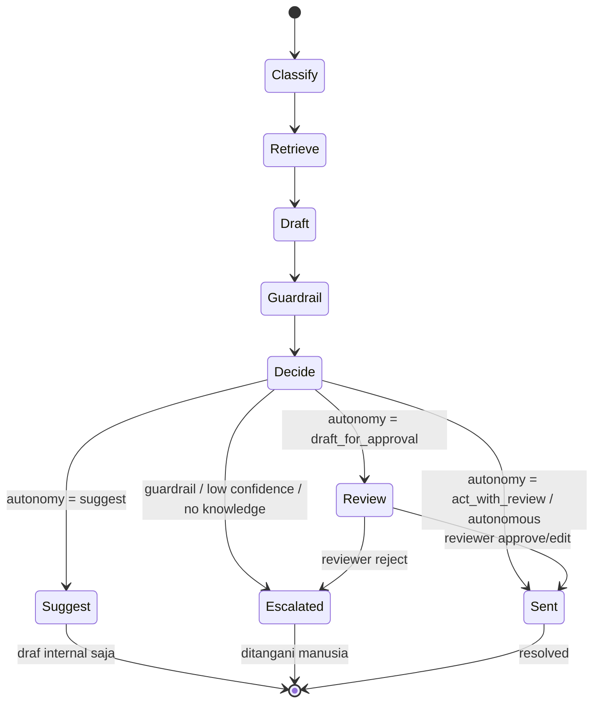

**Aturan keras:** eskalasi **selalu menang** apa pun autonomy level (Human Approval > AI First). Naik ke `autonomous` digate eval (Engineering Bible §8).

---

## 5. Authentication & Tenant Scoping

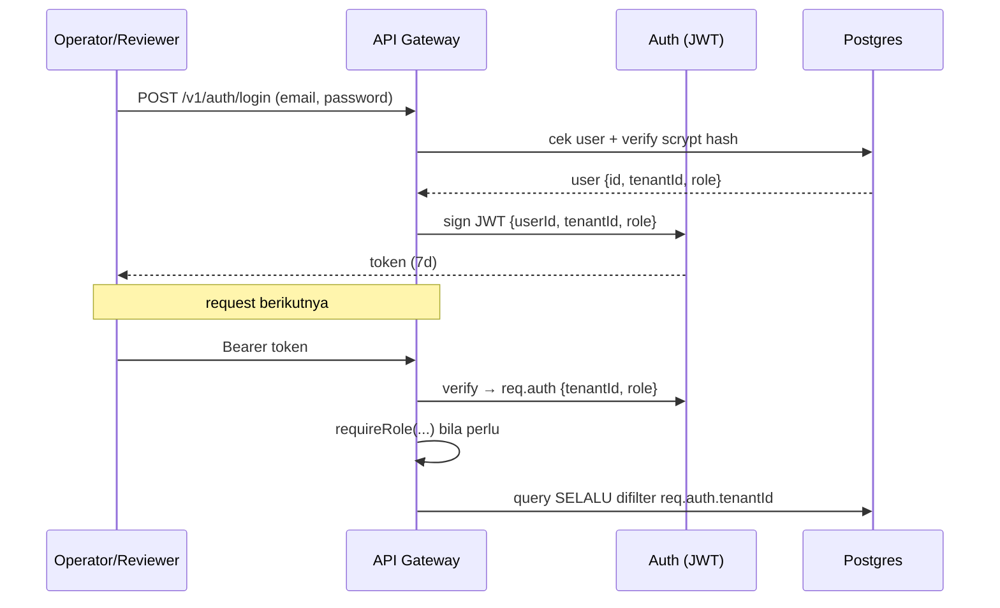

**Non-negotiable:** `tenantId` selalu dari token, tak pernah dari input klien. Default deny. Roadmap: managed auth (Clerk/Auth0/WorkOS) + Postgres RLS sebagai lapis kedua.

---

## 6. Knowledge Base (RAG)

Dua jalur: ingestion (write) & retrieval (read).

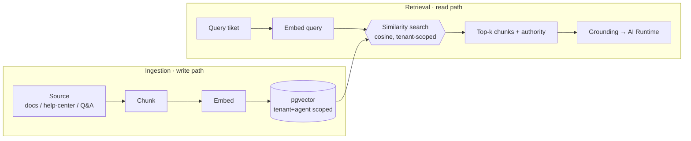

**Kontrak grounding:** jawaban harus bersumber dari KB; bila kosong/lemah → eskalasi, bukan menebak. Koreksi reviewer memperkaya aset ini (Knowledge Is Company Asset).

---

## 7. AI Runtime — Deterministic Shell

Lapisan moat: membungkus model non-deterministik dengan scaffolding deterministik.

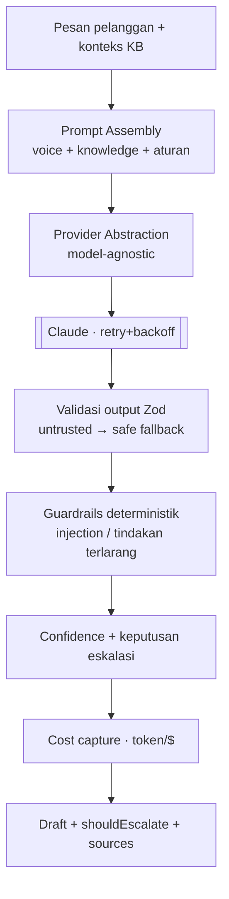

**Prinsip:** output model = untrusted input (selalu divalidasi); guardrail ditegakkan kode bukan diserahkan ke model; tiap panggilan dicatat biayanya.

---

## 8. Event Bus

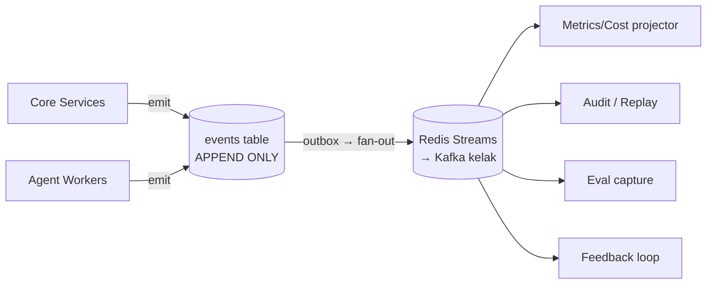

**Keystone:** event log = system of record. Replay, audit, metrik, training data — semua lahir dari satu sumber. Immutable, at-least-once, idempotent consumer.

---

## 9. Database

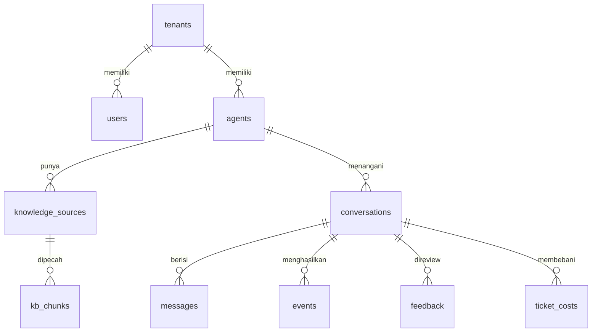

- **PostgreSQL + pgvector** — relational + vektor satu tempat (No premature vector DB).
- **`tenant_id` di setiap baris** + RLS (roadmap) → isolasi multi-tenant.
- **`events` APPEND-ONLY** = system of record.
- **HNSW index** pada `kb_chunks.embedding` untuk retrieval cepat.

---

## 10. Security (lintas lapisan)

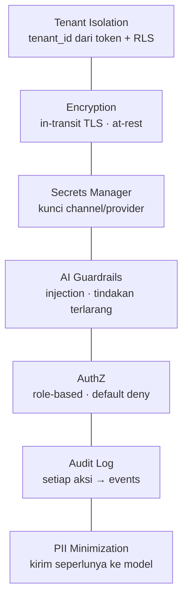

Security By Default: semua aktif sejak baris pertama, bukan upsell enterprise. SEV1 = kebocoran lintas-tenant / jawaban berbahaya ke pelanggan.

---

## 11. Deployment

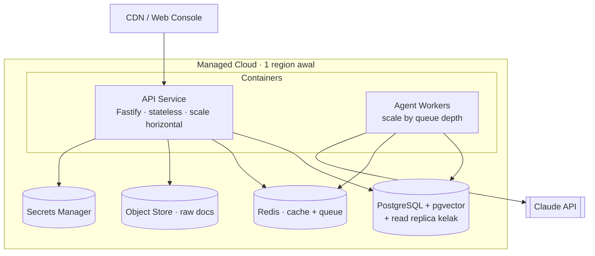

**Keputusan:** container di managed host (BUKAN Kubernetes dulu — pre-revenue). IaC sejak awal. Env: dev/staging/prod terisolasi. CI jalankan typecheck + test + **eval** sebelum deploy.

---

## 12. Monitoring & Observability

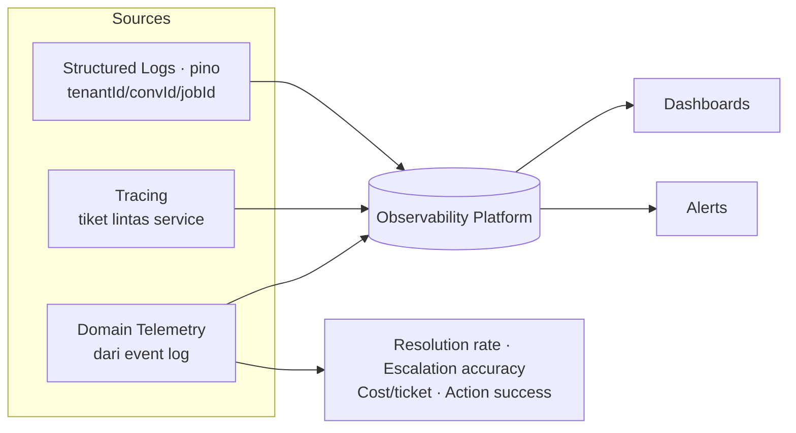

**Dua kelas metrik sama penting:**
- **Teknis:** latency, error rate, queue depth, uptime (≥99.9% target).
- **Domain (dari event log):** resolution rate, escalation accuracy, cost-per-ticket, action-success-rate — KPI bisnis = KPI produk.

**Alert kritikal:** lonjakan escalation/error agent, kebocoran isolasi, cost-per-ticket > ambang, queue backlog. Kill switch: turunkan semua agent ke `draft_for_approval` cepat.

---

## Ringkasan Prinsip → Arsitektur

| Prinsip Produk | Diwujudkan oleh |
|---|---|
| Human Approval | Workflow Engine + Trust Ladder (§4) |
| Everything Is Traceable | Event Bus append-only (§8) |
| Security By Default | Lapisan keamanan (§10) + tenant scoping (§5) |
| No Vendor Lock-In | Provider abstraction di AI Runtime (§7) |
| Knowledge Is Company Asset | Knowledge Base + feedback loop (§6) |
| Offline/Resilient | Async queue + retry + mode offline (§3, §7) |

*Dokumen ini adalah peta. Untuk detail implementasi, lihat [ARCHITECTURE.md](ARCHITECTURE.md) dan kode di `src/`.*
