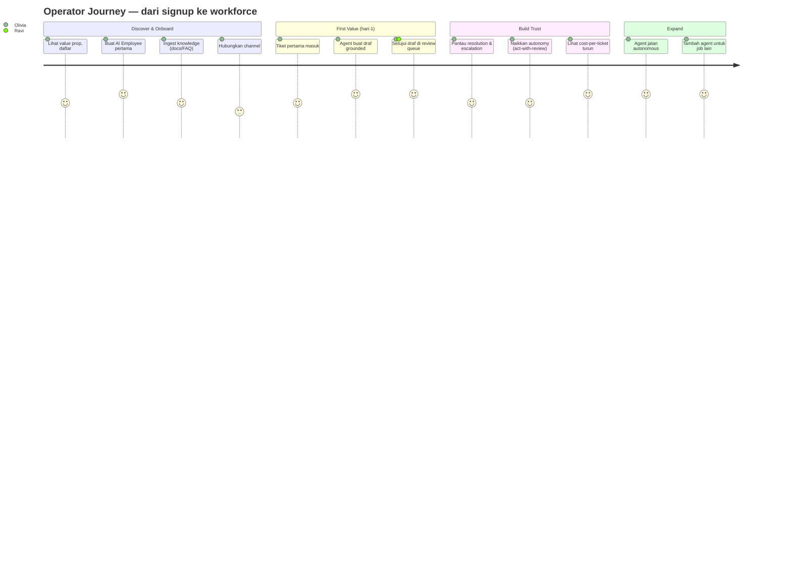
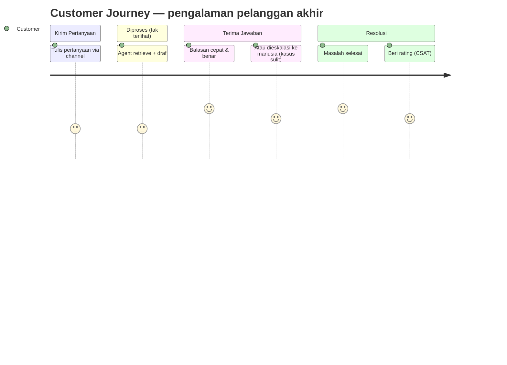
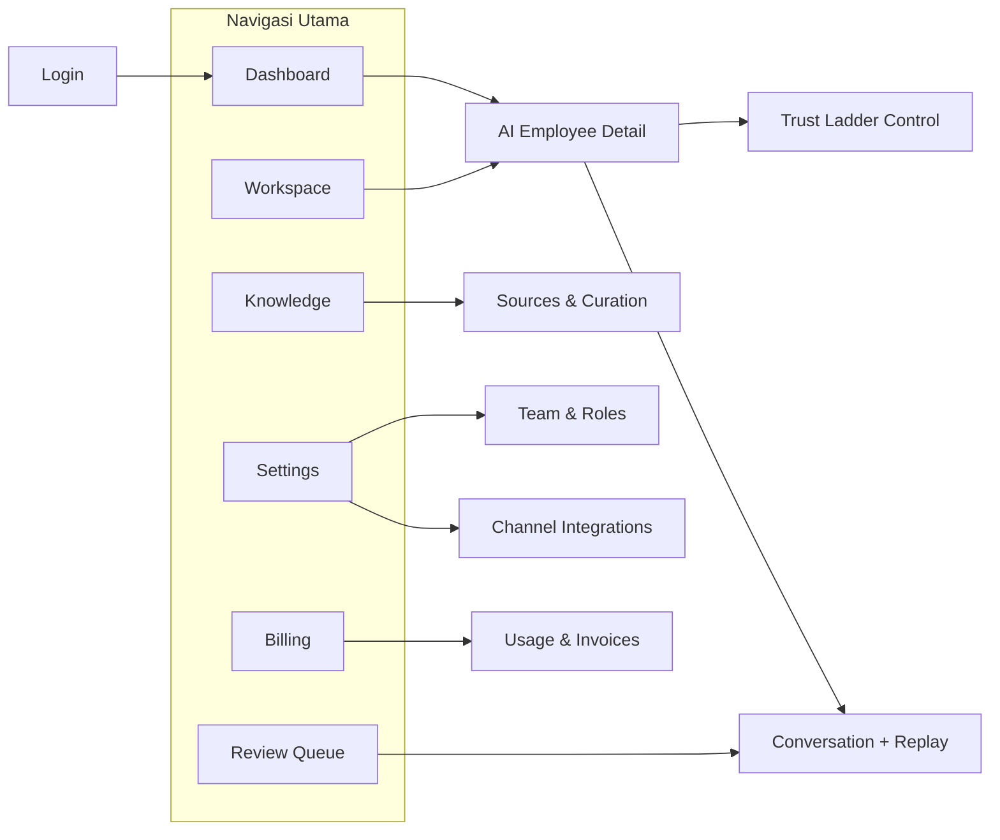

# Genesis AI — User Experience (UX)

> **Versi:** 1.0 · **Owner:** CTO/Product · **Tanggal:** 2026-06-26
> **Status:** UX blueprint v1.0 (wedge: AI Customer Support Agent)
> **Terkait:** [PRD-MASTER.md](PRD-MASTER.md) · [PRODUCT-PRINCIPLES.md](PRODUCT-PRINCIPLES.md) · [AI-EMPLOYEE-HANDBOOK.md](AI-EMPLOYEE-HANDBOOK.md)

---

## Prinsip UX (turunan Product Principles)

1. **Time-to-first-value < 1 hari.** Onboarding harus berujung pada *satu pekerjaan nyata diselesaikan agent* di hari pertama. Setiap layar mengarah ke sana.
2. **Operator non-teknis.** Tidak ada jargon engineering, tidak ada YAML/kode. Konfigurasi = percakapan + contoh.
3. **Human Approval terlihat.** Status trust ladder & kendali otonomi selalu kasat mata. Operator tak pernah merasa kehilangan kontrol.
4. **Everything traceable, di UI.** Setiap percakapan bisa di-replay; setiap angka di dashboard bisa ditelusuri ke sumbernya.
5. **Kepercayaan sebelum kecanggihan.** Default aman (Draft-for-approval). UI mendorong operator menaikkan otonomi *berdasarkan bukti*, bukan dorongan marketing.
6. **Satu pertanyaan di tiap layar:** "Apakah pekerjaan sedang diselesaikan?"

---

## 1. User Journey — Operator (Olivia)

Dari kenal sampai ekspansi. Emoji = level kepuasan.



**Momen krusial UX:** (a) *first draft* — saat Olivia melihat agent menjawab dengan benar dari knowledge-nya → "aha"; (b) *trust graduation* — saat ia menaikkan otonomi dengan tenang karena dashboard membuktikannya.

## 2. Customer Journey — End Customer

Pelanggan tak pernah lihat Genesis. Pengalaman yang dirasakan:



**Prinsip:** pelanggan idealnya tak bisa membedakan dari agen manusia hebat. Eskalasi pun terasa mulus (manusia melanjutkan dengan konteks lengkap, bukan mulai dari nol).

---

## 3. Navigation / Information Architecture

Sitemap console operator. Sidebar kiri = navigasi utama.



**Aturan navigasi:** maksimal 2 klik dari Dashboard ke aksi apa pun. Review Queue diberi badge angka (pekerjaan menunggu) — titik fokus harian Reviewer.

---

## 4. Dashboard

**Tujuan:** menjawab "apakah pekerjaan sedang diselesaikan, dan bisakah saya percaya?" dalam 5 detik. Persona: Olivia.

```
┌─────────────────────────────────────────────────────────────┐
│  Dashboard                                   [ Periode: 7h ▾]│
├─────────────────────────────────────────────────────────────┤
│  ┌──────────────┐ ┌──────────────┐ ┌──────────────┐         │
│  │ RESOLUTION   │ │ ESCALATION   │ │ COST / TIKET │         │
│  │   62% ▲      │ │ akurasi 96%  │ │  $0.014 ▼    │         │
│  └──────────────┘ └──────────────┘ └──────────────┘         │
│  ┌──────────────┐ ┌──────────────┐ ┌──────────────┐         │
│  │ TIKET (7h)   │ │ CSAT         │ │ AKSI SUKSES  │         │
│  │   1,240      │ │  4.6 / 5     │ │   99.4%      │         │
│  └──────────────┘ └──────────────┘ └──────────────┘         │
│                                                              │
│  Volume & resolusi (grafik garis) ▁▂▃▅▆▇                     │
│                                                              │
│  AI Employees                          Review menunggu: (8)  │
│  • Support Bot  · autonomous   · 64% resolved   [Lihat]      │
│  • Billing Bot  · draft        · 41% resolved   [Lihat]      │
└─────────────────────────────────────────────────────────────┘
```

**Elemen:** KPI sesuai [PRD §4] (resolution, escalation accuracy, cost/ticket, CSAT, action success). Tiap kartu **dapat di-klik → ditelusuri ke data sumber** (Everything Traceable). Badge "Review menunggu" jadi CTA harian.

---

## 5. Workspace

**Tujuan:** rumah semua AI Employee tenant; tempat membuat & mengelola agent. Persona: Olivia.

```
┌─────────────────────────────────────────────────────────────┐
│  Workspace · AI Employees                  [ + Hire Agent ]  │
├─────────────────────────────────────────────────────────────┤
│  ┌─────────────────────────────────────────────────────────┐│
│  │ 🤖 Support Bot                              ● autonomous ││
│  │ Resolusi 64% · Eskalasi 9% · Cost $0.012/tiket           ││
│  │ [ Kelola ]  [ Conversations ]  [ Knowledge ]             ││
│  └─────────────────────────────────────────────────────────┘│
│  ┌─────────────────────────────────────────────────────────┐│
│  │ 🤖 Billing Bot                       ● draft-for-approval││
│  │ Resolusi 41% · Eskalasi 22% · masa percobaan             ││
│  │ [ Kelola ]  [ Conversations ]  [ Knowledge ]             ││
│  └─────────────────────────────────────────────────────────┘│
└─────────────────────────────────────────────────────────────┘
```

**"Hire Agent"** sengaja memakai bahasa SDM ("mempekerjakan") — memperkuat mental model *AI employee*, bukan "buat bot". Wizard: pilih job → beri nama & voice → ingest knowledge → set channel → live.

---

## 6. AI Employee (Detail) — pusat Trust Ladder

**Tujuan:** mengelola satu agent: identitas, otonomi, knowledge, performa, percakapan. Layar terpenting untuk **Human Approval**.

```
┌─────────────────────────────────────────────────────────────┐
│  🤖 Support Bot                            ● autonomous       │
│  Voice: "Ramah, ringkas, solutif"                  [ Edit ]  │
├─────────────────────────────────────────────────────────────┤
│  TRUST LADDER (otonomi)                                       │
│  ○ Suggest   ○ Draft-for-approval   ○ Act-with-review        │
│  ● Autonomous                                                │
│  ┌─────────────────────────────────────────────────────────┐│
│  │ ✓ Memenuhi syarat naik: resolusi ≥60%, eskalasi-akurat   ││
│  │   ≥95%, lolos eval. [Turunkan]  [Riwayat perubahan]      ││
│  └─────────────────────────────────────────────────────────┘│
│                                                              │
│  Performa (30h): Resolusi 64% · Eskalasi 9% · CSAT 4.6       │
│  Knowledge: 3 sumber · 412 chunk   [ Kelola Knowledge ]      │
│                                                              │
│  Percakapan terbaru          [ semua ]                       │
│  • #1042 "pengiriman luar jawa"  · resolved   [ Replay ]     │
│  • #1041 "minta refund"          · escalated  [ Replay ]     │
└─────────────────────────────────────────────────────────────┘
```

**Inti UX:** kenaikan otonomi **digate bukti** — tombol "naik" hanya aktif saat KPI & eval terpenuhi (mencegah operator menaikkan terlalu cepat). "Riwayat perubahan" = transparansi. "Replay" membuka jejak penalaran (event log).

---

## 7. Review Queue (inti kerja Reviewer)

**Tujuan:** Ravi menyetujui/menyunting draf dalam hitungan detik; tiap koreksi melatih agent.

```
┌─────────────────────────────────────────────────────────────┐
│  Review Queue (8)                                            │
├──────────────────────┬──────────────────────────────────────┤
│ Tiket menunggu        │ #1043 · "cara ganti alamat kirim?"   │
│ ▸ #1043 Support Bot   │ ─────────────────────────────────────│
│ ▸ #1044 Support Bot   │ Pelanggan: "Saya mau ubah alamat..." │
│ ▸ #1045 Billing Bot   │                                      │
│                       │ Draf agent (confidence 0.82):        │
│                       │ "Untuk mengubah alamat, mohon..."    │
│                       │ Sumber: [#2 FAQ Pengiriman 0.88]     │
│                       │ ┌─────────────────────────────────┐  │
│                       │ │ [ ✓ Approve ] [ ✎ Edit ] [ ✕ ]  │  │
│                       │ └─────────────────────────────────┘  │
└──────────────────────┴──────────────────────────────────────┘
```

**Elemen:** confidence terlihat, **sumber knowledge** terlihat (grounding transparan), aksi satu-klik. Edit tersimpan sebagai sinyal pembelajaran (feedback). Tujuan: approve cepat, bukan menulis ulang.

---

## 8. Settings

**Tujuan:** kelola tim, channel, dan kebijakan tenant. Persona: Olivia (operator/admin).

```
Settings
├── Team & Roles        → undang anggota, set Operator/Reviewer
├── Channels            → hubungkan email/help-desk, status koneksi
├── Brand & Voice       → tone default, logo, kebijakan disclosure AI
├── Escalation Policy   → tindakan yang wajib eskalasi (refund, dll)
└── Security            → sesi, kunci API, audit log, ekspor data (GDPR)
```

**Catatan:** "Escalation Policy" & "AI disclosure" diangkat ke UI karena keduanya keputusan kepercayaan/kepatuhan (Handbook §4–§5), bukan detail teknis tersembunyi.

---

## 9. Billing

**Tujuan:** transparansi nilai vs biaya; ekspansi tanpa friksi. Persona: Olivia/Exec.

```
┌─────────────────────────────────────────────────────────────┐
│  Billing · Paket: Growth                      [ Upgrade ]    │
├─────────────────────────────────────────────────────────────┤
│  Penggunaan bulan ini                                        │
│  Jobs selesai: 8,420 / 10,000 termasuk    ▇▇▇▇▇▇▇▇░░ 84%     │
│  Biaya tambahan (overage): $0                                │
│                                                              │
│  Nilai yang dihasilkan (estimasi)                            │
│  ~8,420 tiket diselesaikan ≈ X jam kerja manusia dihemat     │
│                                                              │
│  Invoice  · Jun 2026  $499   [Unduh]                         │
│  Metode pembayaran  •••• 4242        [ Kelola ]              │
└─────────────────────────────────────────────────────────────┘
```

**Prinsip pricing di UI:** tampilkan **nilai (pekerjaan selesai / jam dihemat)** berdampingan dengan biaya — supaya ROI kasat mata (anchor ke biaya tenaga kerja, bukan software). Upgrade/ekspansi self-serve & instan.

---

## 10. Knowledge

**Tujuan:** kelola aset pengetahuan agent — ingest, kurasi, lihat gap. Persona: Olivia.

```
┌─────────────────────────────────────────────────────────────┐
│  Knowledge · Support Bot                    [ + Tambah ]     │
├─────────────────────────────────────────────────────────────┤
│  Sumber                                                      │
│  • Kebijakan Pengiriman & FAQ   · text · 12 chunk · ✓ ready  │
│  • Help Center (crawl)          · url  · 380 chunk· ✓ ready  │
│  • Q&A Historis                 · csv  · 20 chunk · ✓ ready  │
│                                                              │
│  ⚠ Gap terdeteksi (dari eskalasi)                            │
│  • 14 tiket eskalasi soal "garansi" — knowledge belum ada    │
│    [ Tambah knowledge garansi ]                              │
│                                                              │
│  [ Tandai otoritatif ]  [ Hapus ]  [ Uji pertanyaan ]        │
└─────────────────────────────────────────────────────────────┘
```

**Fitur cerdas:** **"Gap terdeteksi"** — sistem menyarankan knowledge yang hilang berdasarkan pola eskalasi (menutup loop Knowledge Is Company Asset). "Uji pertanyaan" = operator mengetes jawaban agent sebelum live.

---

## Ringkasan UX → Prinsip

| Layar | Prinsip utama yang diwujudkan |
|---|---|
| Dashboard | Everything Traceable (klik → sumber), outcomes-over-output |
| AI Employee Detail | Human Approval (gate bukti), trust ladder visible |
| Review Queue | Human Approval, grounding transparan, feedback loop |
| Knowledge | Knowledge Is Company Asset, gap detection |
| Billing | Pricing = nilai vs biaya tenaga kerja |
| Settings | Security By Default, escalation/disclosure policy eksplisit |

*Blueprint ini memandu desain visual & implementasi front-end (Next.js, API First — console adalah konsumen `/v1/...`). Wireframe di sini adalah low-fidelity; high-fidelity mockup menyusul di tahap desain.*
